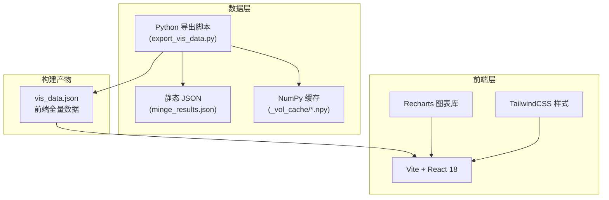

# 先天五行命格 × 波动率预测系统 — 技术架构

## 1. 架构设计



**架构说明**：无后端架构。Python 脚本将所有 .npy + JSON + 预测报告数据合并导出一个 `vis_data.json` 文件，前端直接加载该静态 JSON 作为数据源。纯静态 SPA，可部署到任何静态托管服务。

## 2. 技术选型

| 层级 | 技术 | 版本 | 说明 |
|------|------|------|------|
| 前端框架 | React | 18.x | Hooks + 函数组件 |
| 构建工具 | Vite | 5.x | 快速 HMR，零配置 |
| 样式 | TailwindCSS | 3.x | 原子化 CSS，暗色主题 |
| 图表 | Recharts | 2.x | React 原生图表，轻量灵活 |
| 数据预处理 | Python | 3.10+ | Numpy 转换 + JSON 合并 |
| 包管理 | npm/pnpm | - | - |

## 3. 组件树设计

```
App
├── Header
│   ├── Logo
│   ├── Title ("五行命格 × 波动预测")
│   └── ElementFilter (五行筛选按钮组)
├── StatsCards (4 张统计概览卡片)
├── MainContent
│   ├── S0Scatter (命格散点图 - PCA 降维)
│   ├── GroupList (命格分组列表)
│   │   └── GroupCard (单个命格组卡片)
│   │       └── StockBadge (组内股票标签)
│   └── PairMatrix (配对预测热力图)
└── DetailPanel (右侧/弹窗详情)
    ├── RadarChart (五行雷达图)
    ├── StockSelector (股票选择器)
    └── VolCurve (波动曲线对比图)
```

### 3.1 状态管理

使用 React Context 管理全局状态：

```typescript
interface AppState {
  stocks: Stock[];          // 58 只股票数据
  groups: Group[];          // 命格分组
  pairs: Pair[];            // 32 个配对数据
  selectedGroup: string | null;  // 选中的命格组
  selectedStocks: string[];      // 选中的对比股票 (2只)
  activeElements: string[];      // 激活的五行筛选
}
```

## 4. 路由定义

单页应用，无需路由。所有面板通过状态切换控制显隐：

| 路由 | 页面 |
|------|------|
| `/` (单页) | 五行命格 × 波动预测仪表盘 |

## 5. 数据模型

### 5.1 vis_data.json 结构

```json
{
  "stocks": [
    {
      "sym": "sz300750",
      "name": "宁德时代",
      "listing": "2018-06-11",
      "s0": [1, 2, 3, 0, 0],
      "label": "土旺缺金水",
      "s0_normalized": [0.17, 0.33, 0.50, 0, 0]
    }
  ],
  "groups": [
    {
      "label": "土旺缺火金",
      "s0": [2, 0, 3, 0, 1],
      "members": ["同花顺", "洋河股份", "中信证券", "紫金矿业"],
      "size": 4
    }
  ],
  "pairs": [
    {
      "target": "中信证券",
      "target_sym": "sh600030",
      "source": "紫金矿业",
      "source_sym": "sh601899",
      "label": "土旺缺火金",
      "h1_ridge": 0.5,
      "h1_xgb": 54.7,
      "h5_ridge": 0.2,
      "h5_xgb": 24.4
    }
  ],
  "vol_data": {
    "sh600030": {
      "dates": ["2020-01-02", "2020-01-03", ...],
      "vol": [0.015, 0.016, ...]
    }
  },
  "stats": {
    "total_stocks": 58,
    "total_groups": 45,
    "multi_groups": 11,
    "total_pairs": 32,
    "xgb_avg": 54.91,
    "ridge_avg": 0.60
  }
}
```

### 5.2 数据预处理

Python 导出脚本 `export_vis_data.py` 负责：

1. 读取 `minge_results.json` 获取 S₀ 数据
2. 解析 `predict_report.txt` 提取配对预测结果
3. 读取 `_vol_cache/*.npy` 提取波动率序列（按需抽样，每 5 日取 1 点减少体积）
4. 计算归一化 S₀ 向量（除以最大值）
5. 聚合统计指标
6. 输出 `economics/vis_data.json`

## 6. 设计约束与性能目标

| 指标 | 目标 |
|------|------|
| 首屏加载时间 | < 2s (静态 JSON < 5MB) |
| 交互响应时间 | < 100ms |
| 浏览器兼容 | Chrome/Firefox/Edge 最新 2 个版本 |
| 数据体积 | vis_data.json < 10MB（波动率抽样控制） |
| 无外部依赖 | 无需后端服务，纯静态部署 |
