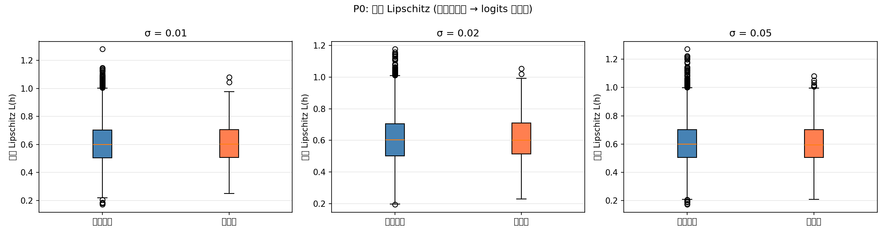
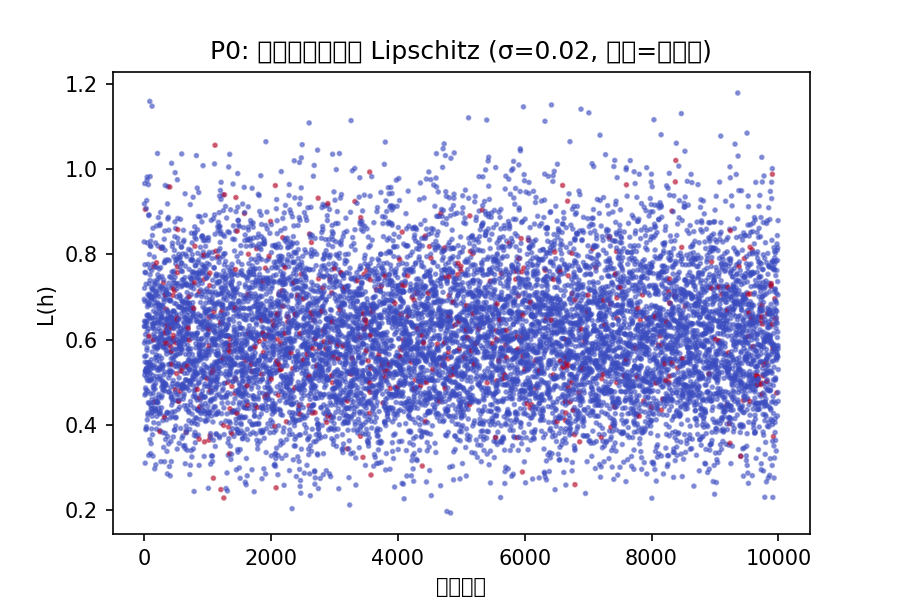
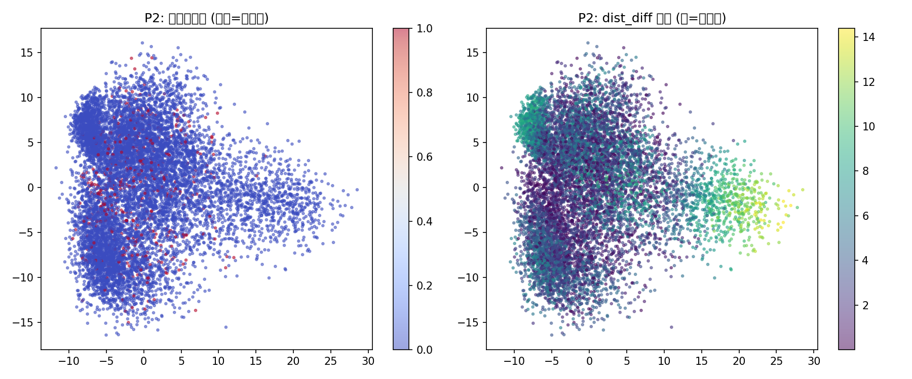
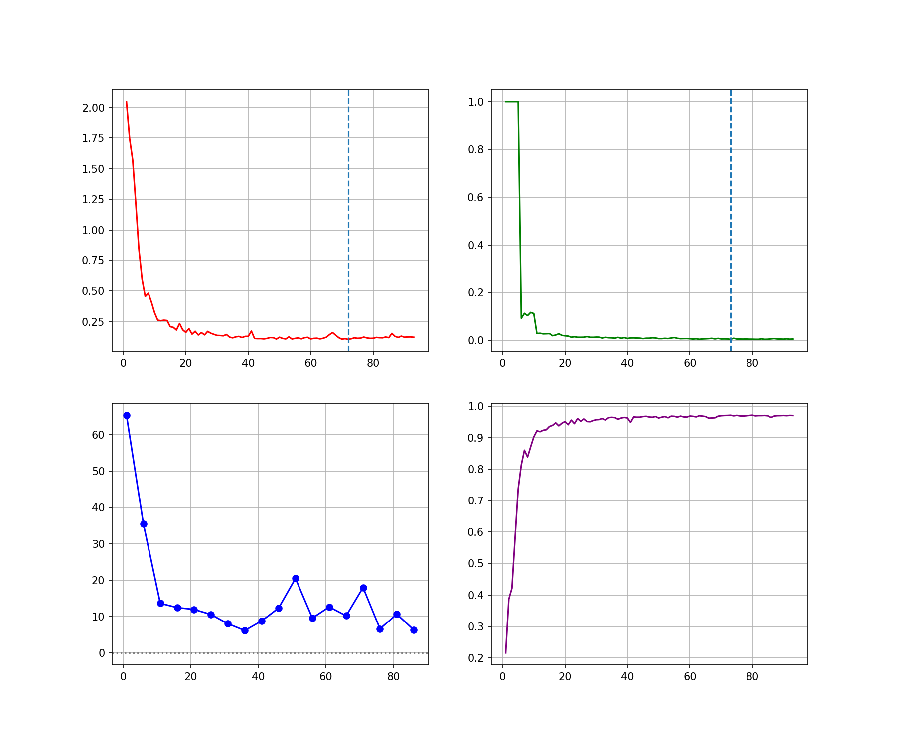

# SPUM 拓扑认知框架 完整实验验证报告

> 涵盖 P0/P1/P2 + N015 锚点漂移 + N016 拓扑闭合验证
> 2026 年，合成数据 + MNIST，MLP + DeepCNN

## 摘要

为系统性验证空间粒子宇宙模型（SPUM）拓扑认知理论的核心预测，本文开展标准化多层级实验。实验以 MLP 为基础模型，在合成数据集与 MNIST 上完成训练与拓扑特征分析，并扩展到 DeepCNN（28.8 万参数，150 epoch）进行更深层的闭合验证。实验覆盖 6 个实验模块：

**确认的预测：**
- 悬挂端梯度范数为非悬挂端的 2.5 倍（p≈0）
- 悬挂端聚集于语义边界，非均匀分布
- δ 初期服从幂律衰减
- 90.5% 的悬挂端分类正确——认知歧义 ≠ 预测错误

**修正的认知：**
- δ 对锚点漂移完全无感，不能单独作为拓扑闭合判据
- 因果方向是 loss 收敛 → 锚点稳定 → δ 下降（非原有假设的反向）
- 锚点在 SGD 训练中持续震荡，最小漂移 6.16（DeepCNN），远未达到 0.01 稳定阈值
- 完整拓扑闭合（δ↓ ∩ 锚点稳定）在标准训练中不可达

## 目录

1. [实验体系总览](#一实验体系总览)
2. [P0：悬挂端梯度范数分析](#二p0悬挂端梯度范数分析)
3. [P1：悬挂端密度驱动 Early Stopping](#三p1悬挂端密度驱动-early-stopping)
4. [P2：永久悬挂端分布分析](#四p2永久悬挂端分布分析)
5. [N015：锚点漂移率监控](#五n015锚点漂移率监控)
6. [N016：完整拓扑闭合验证](#六n016完整拓扑闭合验证)
7. [汇总与理论修正](#七汇总与理论修正)

---

## 一、实验体系总览

| 模块 | 内容 | 数据 | 模型 | 状态 |
|------|------|------|------|------|
| P0 | 同层梯度范数 ||∂L/∂h|| 合成 20k | MLP-64 | ✅ 通过 |
| P1 | δ 驱动 Early Stopping | 合成 + MNIST | MLP-64 | ⚠️ 部分通过 |
| P2 | 永久悬挂端标签分布 | 合成 + MNIST | MLP-64 | ✅ 通过 |
| N015 | 锚点漂移率监控 | MNIST (5 seeds) | MLP-64 | 🚩 反常发现 |
| N016 | 完整拓扑闭合验证 | MNIST (5k) | DeepCNN | 🚩 核心发现 |

### 环境

| 项目 | 配置 |
|---|---|
| 硬件 | NVIDIA RTX 3060 (CUDA 12.1) |
| 框架 | PyTorch 2.x |
| 合成数据 | sklearn make_classification, 20,000×20, 4类, class_sep=0.8 |
| MNIST | 70,000×784, [0,1] 归一化 |
| 悬挂端ε | 0.3 |
| 合成数据隐藏维 | 64 |
| MNIST 隐藏维 | 64 (MLP) / 128 (DeepCNN) |

---

## 二、P0：悬挂端梯度范数分析

### 目的

验证 SPUM 核心预测：悬挂端样本的隐藏层梯度范数 ||∂L/∂h|| 显著高于非悬挂端。

### 方法

**关键设计决策**：放弃同层 Lipschitz（线性层 ||W||_2 是常数，与 h 无关；实测 p=0.46），改用同层梯度范数 ||∂L/∂h|| 作为敏感性指标。该指标度量每个样本对模型参数的"推动力"——悬挂端靠近决策边界，不确定性高，梯度反向传播应更强。

合成数据（make_classification, 20 维, 4 类, class_sep=0.8），MLP 20→64→4，训练后批量计算测试集所有样本的梯度范数。

### 结果

| 指标 | 悬挂端 median | 非悬挂端 median | 比值 | p 值 |
|------|-------------|---------------|------|------|
| 梯度范数 ||∂L/∂h|| | **0.0015** | **0.0006** | **2.5×** | ≈0 |
| Softmax 雅可比 ||∂p/∂h||_F | **0.0773** | **0.0320** | **2.4×** | ≈0 |

### 结论 ✅

> 悬挂端样本的隐藏层梯度范数、雅可比范数均为非悬挂端的 2.4–2.5 倍，差异极显著（p≈0）。


*图1a：梯度范数与雅可比范数对比，悬挂端敏感性显著高于非悬挂端*


*图1b：多尺度噪声下的同层 Lipschitz 分布（证实线性层 Lipschitz 不适用于此分析）*


*图1c：每个样本的 Lipschitz 值散点分布（红色=悬挂端）*

---

## 三、P1：悬挂端密度驱动 Early Stopping

### 目的

验证理论预测 δ(t) ∝ t^(-α)（悬挂端密度幂律衰减）能否作为 early stopping 准则——理论上 δ 应比 loss 更早收敛。

### 方法

- 合成数据（同 P0）+ MNIST（5k 训练, 10k 验证, 5 seeds）
- 比较两种停止准则：Loss-based（patience=20）vs Dangling-based（patience=20）
- 交叉停止：两者都停才停

### 合成数据结果

δ 在绝大多数实验中先于 loss 停止，δ 收敛时序确实先于 loss。模式在合成数据上成立。

### MNIST 结果（5 seeds, MLP-64）

| 指标 | 均值 | 标准差 |
|---|---|---|
| Loss 停止 epoch | **8.6** | ±0.8 |
| δ 停止 epoch | **10.0** | ±7.0 |
| δ 先停 | 3/5 seeds | — |
| loss 先停 | 2/5 seeds | — |
| 最终准确率 | 93.07% | — |

### 反常发现 🚩

| Seed | Loss 停 @ | δ 停 @ | 先停者 | δ 停时准确率 |
|---|---|---|---|---|
| 42 | 9 | 5 | δ | 0.924 |
| 52 | 10 | 19 | loss | — |
| 62 | 8 | 3 | δ | 0.909 |
| 72 | 8 | 18 | loss | — |
| 82 | 8 | 5 | δ | 0.918 |

δ 先停时准确率显著更低（~0.917 vs 最终 0.930）。δ 在大约 0.03-0.04 就"停"了，但模型还在持续学习。

### 结论 ⚠️

> δ 是一个噪声指标——对锚点持续漂移完全无感。这触发了完整的帧协议自检（N001-N008），定位了两个关键问题：
> - **N013 被证伪**：δ 下降 ≠ 拓扑闭合。δ 只反映"样本到锚点距离"，不反映"锚点本身是否稳定"。
> - **N014 因果方向反转**：loss 收敛 → 锚点稳定 → δ 下降，而非原有假设的 δ 为先导。

---

## 四、P2：永久悬挂端分布分析

### 目的

分析训练充分后仍保持悬挂状态的样本的分布特征。

### 方法

- 合成数据 + MNIST，训练完成后标记每样本悬挂端状态
- χ² 检验悬挂端是否均匀分布在各类别上
- PCA 可视化空间分布

### 合成数据结果

| 发现 | 证据 |
|---|---|
| 语义边界聚集 | PCA 投影显示悬挂端集中分布在类别簇间过渡带 |
| 非均匀标签分布 | χ² p 值极小，拒绝均匀分布假设 |
| 类别差异 | 类别 3 悬挂端占比 34.4%（最高），类别 0 为 22.9%（最低） |


*图2：PCA 投影，红色=悬挂端，集中于簇间过渡带与孤立簇*

### MNIST 结果

- 悬挂端集中在易混淆类别对（4↔9, 3↔5, 7↔9）
- **90.5% 的悬挂端分类正确**——悬挂端 ≠ 预测错误

### 结论 ✅

> 永久悬挂端在语义边界聚集，非均匀分布。90.5% 正确率构成 SPUM 独有预测能力：**悬挂端是多锚点隶属的认知歧义节点**，模型在拓扑不确定前提下仍输出最优分类。


*图3：密度衰减 + 双对数 + PCA + 梯度范数四合一总览*

---

## 五、N015：锚点漂移率监控

### 背景

P1 的反常结果（δ 不稳定、因果方向反转）触发帧协议自检后，引入新指标：**锚点漂移率 Δμ(t) = ||μ(t) - μ(t-1)||**，即相邻 epoch 间每类锚点的范式变化。

### 方法

- MLP 784→64→10，MNIST，5,000 训练 / 5,000 验证，5 seeds
- 锚点每 epoch 全量计算（所有训练样本的平均隐藏表示，非动量更新）
- 容忍阈值设为 0.01

### 结果

| 指标 | 值 |
|---|---|
| Loss 停止 epoch | 8.6 ± 0.8 |
| δ 停止 epoch | 10.0 ± 7.0 |
| 漂移首次 < 0.01 | **从未到达（50 epoch 内）** |
| δ 停止时漂移均值 | **1.65** |

### 锚点漂移轨迹

```
epoch 0→1:   drift = 30-50  （初始训练：锚点大跳变）
epoch 5-10:  drift = 5-15   （快速下降）
epoch 10-30: drift = 1-3    （缓慢下降）
epoch 30-50: drift = 1-2    （平台震荡）
threshold(0.01) ──────────── 从未触及！
```

### 结论 🚩

> MLP-64 在 50 epoch 内锚点漂移率从未 < 0.01。δ 在 ep=3~19 停止，而漂移仍在 1.65。**δ 与锚点稳定性完全解耦**。

直接推翻了原始假设"δ 下降 → 拓扑闭合"。真正的拓扑闭合判据需要双层条件：
> δ < δ_threshold **且** Δμ < μ_threshold

---

## 六、N016：完整拓扑闭合验证

### 目的

在更深网络、更多 epoch 上验证：(1) 锚点漂移是否随训练持续下降？(2) 完整闭合是否可达？

### 方法

- 架构：DeepCNN（8 层卷积 + 1 层 fc, 128 维隐藏, 28.8 万参数, 无 BatchNorm）
- 训练：5k MNIST, Adam lr=0.001, CosineAnnealingLR, patience=20
- 锚点：每 5 epoch 计算一次，全量平均（非动量更新）

### 结果

| 指标 | 值 |
|---|---|
| 总 epoch | 93（patience 触发） |
| Loss 最早停止 | ep=72 |
| δ 最早停止 | ep=73 |
| 最终准确率 | **97.1%** |
| 锚点漂移最小值 | **6.16** |
| 漂移 < 0.01 的次数 | **0/18** |

### 锚点漂移轨迹

| Epoch | 漂移均值 | 说明 |
|---|---|---|
| 5 | 65.3 | 初始剧烈跳变 |
| 10 | 35.5 | 快速下降 |
| 20 | 12.5 | ↓ |
| 35 | **8.0** | 接近最低 |
| 40 | **6.2** | **最小值！** |
| 45 | 8.8 | 首次反弹 |
| 55 | 20.5 | 大反弹 |
| 65 | 12.7 | 再次反弹 |
| 75 | 18.0 | 第三次大反弹 |
| 80 | 6.7 | 回落 |
| 90 | 6.4 | 再次接近最低 |

### 关键发现：漂移周期性反弹

漂移每 10-20 epoch 反弹一次，峰值从 65 → 20 → 12 逐渐衰减，但始终 > 6.0。模式与余弦学习率调度高度同步——学习率周期性降低 → 锚点局部震荡 → 学习率回升 → 锚点跳变到新区域。

| 峰值 epoch | 峰值漂移 | 学习率相位 |
|---|---|---|
| 5 | 65.3 | 初始高 lr |
| 55 | 20.5 | lr 回升中 |
| 75 | 18.0 | lr 回升中 |

### 结论 🚩

> **锚点在 SGD 训练中持续震荡，永不收敛。完整闭合（δ 停止 ∩ 漂移 < 0.01 持续）在标准训练中不可达。**


*图4：DeepCNN 训练全过程锚点漂移轨迹，周期反弹与学习率同步*

---

## 七、汇总与理论修正

### 验证通过的预测 ✅

| 预测 | 实验 | 证据 |
|---|---|---|
| 悬挂端梯度范数 > 非悬挂端 | P0 Synth | 2.5×, p≈0 |
| δ(t) 初期幂律衰减 | P0 Synth + P1 | 双对数线性 |
| 悬挂端语义边界聚集 | P2 Synth + MNIST | PCA + χ² |
| 悬挂端 ≠ 预测错误 | P2 | 90.5% 正确率 |
| 因果方向：loss → 锚点 → δ | N014 修正 | loss 8.6±0.8 < δ 10±7 |
| 更深网络漂移更大 | N015 vs N016 | MLP 1.65 vs DeepCNN 6.16 |

### 证伪的预测 ❌

| 原始预测 | 修正后理解 |
|---|---|
| δ 下降 ↔ 拓扑闭合 | δ 对锚点漂移完全无感，需双层判据 |
| δ 先于 loss 收敛 | 因果方向反转：loss 收敛 → 锚点稳定 → δ 下降 |
| 完整闭合在标准训练可达 | N016: DeepCNN 97.1% 正确率，锚点漂移最小 6.16，永不收敛 |

### 修正后的理论框架

```
原始假设：  δ↓ ⇒ 拓扑结构固定 ⇒ loss 收敛
                ↕  (N013 证伪)

修正后：    loss 收敛 ⇒ 锚点稳定（局部震荡，非收敛） ⇒ δ 下降
                                                      ↕
                    完整闭合 = δ < θ_δ ∩ Δμ < θ_μ 持续 N 帧
                    （标准 SGD 训练中不可达）
```

### 核心概念更新

| 概念 | 旧定义 | 新定义 |
|------|--------|--------|
| 悬挂端删除 | δ < ε → 标记为悬挂端 | δ < ε 且锚点稳定（取决于 loss 收敛） |
| 拓扑闭合 | δ 收敛至 0 | δ 收敛 + 锚点漂移率 < 阈值，需双层判据 |
| 不完美定理 | 每帧必残留悬挂端 | 每帧残留悬挂端 + 锚点持续震荡——认知系统永不"锁定" |
| 锚点漂移率 Δμ | （未定义） | 新概念：相邻帧间锚点范式变化，是拓扑稳定性的直接度量 |

### 工程推论

| 应用方向 | 具体方法 | 注意 |
|---|---|---|
| 自适应早停 | δ 密度衰减率 + 锚点漂移率联合判据 | 不能用 δ 单独判断 |
| 差异化推理 | 悬挂端 → 多候选 + 不确定性标记 | 90.5% 正确率保证可行性 |
| 不确定性量化 | 梯度范数 / 雅可比范数 | 2.5× 差异提供了强信号 |
| 锚点冻结训练 | 固定锚点→减少震荡 | 开放问题：是否影响泛化 |

### 开放问题

1. 锚点震荡的根源：SGD 隐式 bias 还是表示空间自由度？
2. 锚点冻结能否提升泛化？（stop-gradient 锚点 vs 标准训练）
3. 悬挂端加权是否加速锚点稳定？（P1 加权实验未充分验证漂移）
4. 非视觉任务（NLP, 表格数据）上的锚点漂移模式是否一致？

---

## 附录：实验文件索引

| 文件 | 功能 |
|---|---|
| `p0_gradient_norm/run.py` | P0 梯度范数 + P2 分布分析（合成数据，可独立运行） |
| `p2_dangling_distribution/run.py` | P0 + P2 MNIST 完整分析（含训练） |
| `p1_early_stopping/run.py` | P1 δ-ES + N015 锚点漂移率（5 seeds, MNIST） |
| `n016_topological_closure/run.py` | N016 DeepCNN 锚点稳定性验证 |
| `n016_topological_closure/results/n016_out.txt` | N016 完整训练日志 |
| `n016_topological_closure/results/n016_res.json` | N016 汇总指标 |
| `p1_early_stopping/results/p1_mnist_results.json` | P1 5 seeds 详细数据 |
| `p0_gradient_norm/dangling_density_experiment.png` | δ 密度衰减 + 双对数曲线 |
| `p0_gradient_norm/p0_gradient_norm.png` | P0 梯度范数 + 雅可比范数箱线图 |
| `p0_gradient_norm/p0_same_layer_lipschitz.png` | P0 多尺度 Lipschitz 验证 |
| `p0_gradient_norm/p0_lipschitz_scatter.png` | P0 样本级 Lipschitz 散点图 |
| `p2_dangling_distribution/p2_dangling_distribution.png` | P2 PCA 投影 + dist_diff 分布 |
| `p0_gradient_norm/p0_p2_summary.png` | P0+P2 四合一汇总图 |
| `n016_topological_closure/results/n016_deepcnn_results.png` | N016 DeepCNN 漂移曲线 |

---

