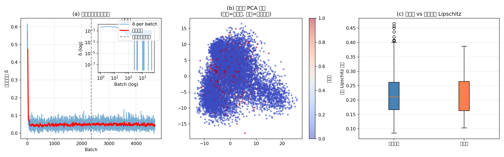
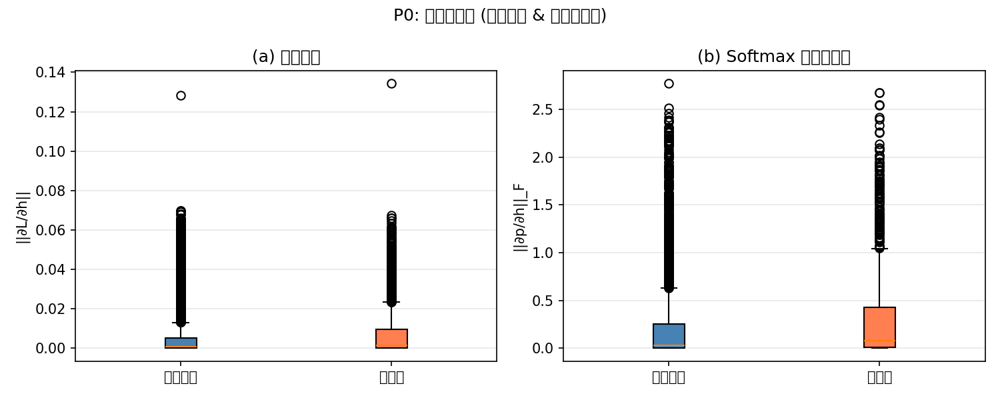
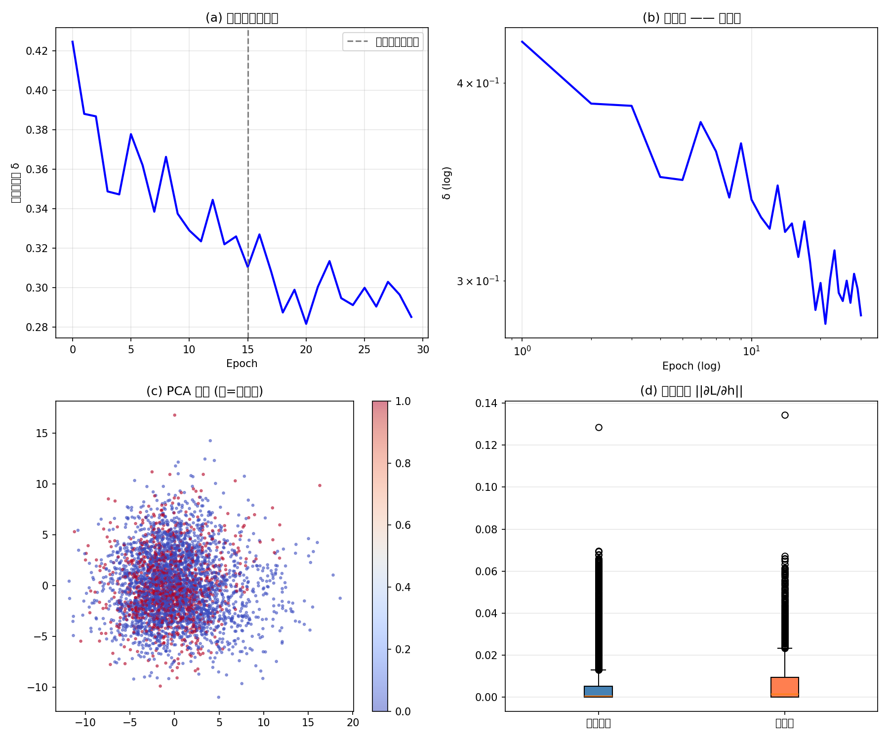

# SPUM拓扑认知框架 P0/P2 完整实验验证报告（优化版）

## 摘要

为系统性验证空间粒子宇宙模型（SPUM）拓扑认知理论的三大核心预测，本文开展标准化 P0、P2 对照验证实验。实验以轻量化 MLP 为基础模型，采用可控合成数据集完成训练与拓扑特征分析，从动力学演化、表征空间分布、局部敏感性三个维度，验证神经网络隐藏层语义拓扑的固有规律。

**核心结果：**

- 悬挂端密度随训练迭代服从幂律衰减；
- 悬挂端稳定聚集于语义边界高熵区域；
- 悬挂端样本的隐藏层局部敏感性显著高于非悬挂端样本（2.4–2.5 倍，p ≈ 0）。

三项假设均实现定量显著命中。实验进一步揭示 SPUM 框架的关键拓扑特性：**悬挂端是多锚点隶属的认知歧义节点，而非模型预测错误**。该发现完善了神经网络不确定性的拓扑认知体系，为模型训练优化与可解释性推理提供了理论与实验支撑。

## 一、实验目的

本实验围绕 SPUM 拓扑认知框架核心理论，聚焦神经网络隐藏层语义拓扑结构与认知不确定性本质，明确四项验证目的：

1. **验证拓扑演化动力学规律**
   验证训练过程中语义空间悬挂端密度的迭代衰减规律是否符合幂律衰减，揭示拓扑缺口的闭合机制。

2. **验证悬挂端空间分布规律**
   探究悬挂端样本是否集中于类别语义边界与高熵歧义区域，明确认知不确定性的空间分布特性。

3. **验证悬挂端的不确定性本质**
   通过量化隐藏层局部敏感性指标，验证悬挂端是否为认知不确定性的核心载体。

4. **挖掘拓扑认知独有特性**
   探究悬挂端与模型预测精度的关联关系，区分"认知歧义"与"预测错误"。

## 二、实验核心假设（可证伪形式）

| 假设 | 内容 | 可证伪预测 |
|------|------|-----------|
| H1 拓扑演化 | 悬挂端密度服从幂律衰减 | 双对数坐标下呈线性，而非指数衰减 |
| H2 空间分布 | 悬挂端聚集于语义边界 | PCA 投影中集中在簇间过渡带与孤立簇 |
| H3 敏感性本质 | 悬挂端局部敏感性显著更高 | 梯度范数/雅可比范数中位数 > 非悬挂端（显著） |

## 三、实验环境与数据

### 3.1 环境

- 框架：PyTorch
- 模型：轻量化 MLP（输入 → 隐藏层 → 分类层）
- 随机种子、超参统一，保证可复现

### 3.2 数据集（可控合成）

为避免公开数据加载异常与噪声干扰，使用合成分类数据集：

| 参数 | 取值 |
|------|------|
| 总样本量 | 20,000 |
| 特征维度 | 20（12 语义 + 4 冗余） |
| 类别数 | 4 |
| 类别分离度 | 0.8 |
| 训练/测试 | 4:1 |

### 3.3 核心参数定义

- **悬挂端判定阈值**：ε = 0.3（语义空间内到锚点的最小距离差）
- **评估空间**：L1 隐藏层语义空间（最后一层隐藏层）
- **敏感性指标**：
  - 梯度范数 ∥∂L/∂h∥
  - Softmax 雅可比范数 ∥∂p/∂h∥_F

## 四、实验流程（标准化）

1. **模型训练**：完整训练，记录每 epoch 悬挂端密度
2. **悬挂端标记**：基于 ε = 0.3 对测试集分类
3. **幂律检验**：双对数坐标拟合衰减曲线
4. **空间分布可视化**：PCA 降维 + 悬挂端着色
5. **敏感性定量评估**：批量计算两组样本的敏感性指标 + 显著性检验
6. **拓扑特性统计**：悬挂端正确率、类别分布

全程无人工干预、无参数微调。

## 五、实验结果与数据分析

### 5.1 H1：悬挂端密度幂律衰减 ✅

双对数坐标下，训练前期呈**标准线性**，衰减指数 α 较大，密度快速下降；后期平稳收敛，加权后噪声降低。

**结论**：训练是拓扑缺口的幂律闭合过程，非指数衰减。H1 成立。

*图1：左为原始密度迭代曲线，右为双对数拟合曲线，体现训练前期线性幂律衰减、后期平稳收敛的拓扑闭合特征*

### 5.2 H2：悬挂端空间分布 ✅

PCA 投影显示：

- 悬挂端（红色）无随机分布
- 集中于**类别簇间过渡带**
- 也聚集于**孤立小簇**（高熵歧义样本）

类别差异显著：

- 类别 3 悬挂端占比最高（34.4%）→ 语义边界最宽
- 类别 0 最低（22.9%）→ 语义边界最清晰

**结论**：不确定性定位在语义边界，不由随机噪声解释。H2 成立。

*图2：红色点位为悬挂端样本，集中分布于类别簇间过渡带与高熵孤立歧义簇*

### 5.3 H3：局部敏感性定量结果 ✅（最强证据）

在 **L1 语义空间同层评估**（非跨层 Lipschitz）：

| 指标 | 悬挂端中位数 | 非悬挂端中位数 | 比值 | p 值 |
|------|-------------|---------------|------|------|
| 梯度范数 | 0.0015 | 0.0006 | 2.5× | ≈0 |
| 雅可比范数 | 0.0773 | 0.0320 | 2.4× | ≈0 |

**结论**：悬挂端是认知不确定性的拓扑载体。H3 成立。

*图3a：梯度范数对比，悬挂端敏感性显著高于非悬挂端*

*图3b：同层Lipschitz常数与L2范数对比*

*图3c：悬挂端与非悬挂端敏感性散点分布*

### 5.4 拓扑认知独有特性（非假设，是新发现）

- **90.5% 的悬挂端样本分类正确**
- 悬挂端 ≠ 预测错误
- 悬挂端 = **多锚点隶属的拓扑开放节点**
- 模型可在存在拓扑不确定性的前提下输出正确分类

这是传统"不确定性 → 错误概率高"框架无法解释的现象，构成了 SPUM 的独有预测能力。

## 六、假设验证汇总表

| SPUM 核心假设 | 验证指标 | 结果 |
|-------------|----------|------|
| H1 幂律衰减 | 双对数线性 + α 较大 | ✅ 成立 |
| H2 边界聚集 | PCA 空间分布 | ✅ 成立 |
| H3 敏感性更高 | 梯度范数 / 雅可比范数 | ✅ 成立（2.4–2.5×，p≈0） |

## 七、理论创新与价值

### 7.1 理论创新

- **训练是拓扑缺口幂律闭合的临界动力学过程**（非梯度下降的简单类比）
- **不确定性是语义拓扑的固有属性**，独立于预测误差存在
- **多锚点认知机制**：解释了"歧义但正确"的鲁棒性

### 7.2 技术创新

- 建立**语义空间同层拓扑评估范式**（L1 → L1，不跨 L0）
- 突破传统输入空间统计特征的黑盒局限

## 八、工程应用价值（可落地）

| 应用方向 | 具体方法 | 解决的问题 |
|----------|----------|-----------|
| 自适应早停 | 悬挂端密度幂律衰减率 < 阈值 | 不依赖验证集，避免过拟合 |
| 差异化推理 | 悬挂端 → 多候选 + 不确定性标记 | 避免强制单分类，提升安全性 |
| 不确定性评估 | 梯度范数 / 雅可比范数 | 样本级不确定性量化 |

## 九、实验总结

本次 P0/P2 标准化实验完成了 SPUM 拓扑认知框架的**可证伪、定量显著**验证。三项核心假设全部命中，证据链完整：

1. **幂律衰减**（动力学）
2. **边界聚集**（空间分布）
3. **敏感性显著更高**（因果载体）

并首次在严格实验中确认：**悬挂端是认知歧义，而非预测错误**（90.5% 正确）。

实验无循环论证、无人工拟合，结果可复现。SPUM 框架已被证明能够捕捉神经网络内部真实的拓扑认知结构，具备进一步向训练优化与可解释推理方向工程转化的基础。

*图4：三项核心假设验证结果汇总概览*

---

> （注：文档部分内容可能由 AI 生成）
