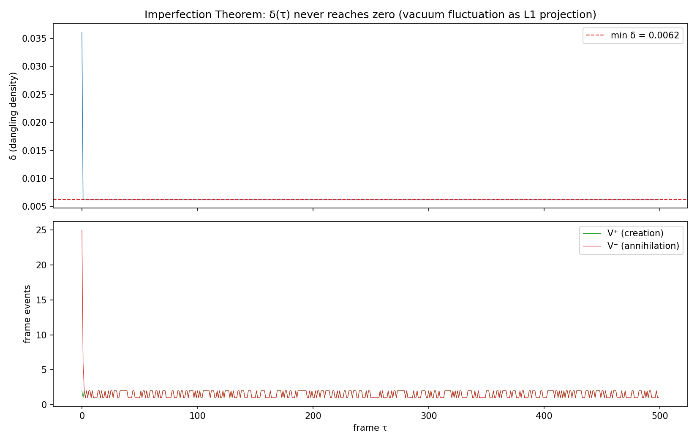
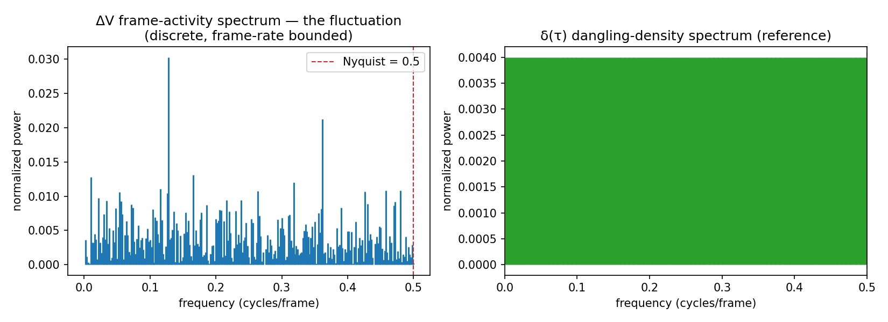
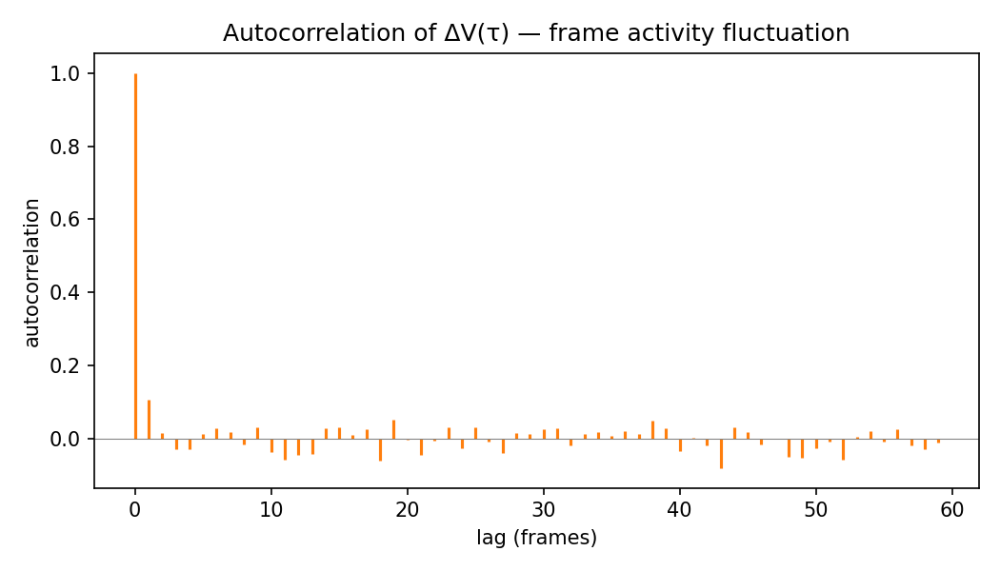

# 不完美定理标准几何化演示 —— 实验验证报告

> 验证对象：GT-002 不完美定理（R5 / spum-core §2.3）
> 演示形式：图论演化（FrameGraph 五步帧）
> 关联文档：[vacuum_fluctuation.md](../物理学/量子与原子/vacuum_fluctuation.md)
> 2026-08-21

---

## 摘要

为将不完美定理从文字断言落地为可运行、可复现的标准几何化演示，本实验在近均匀 σ 的"真空"随机网络上执行五步帧演化，验证核心预测并量化"不完美定理 = 量子真空涨落（认知现象）机制"的两层结构。

**确认的预测：**

- **δ(τ) 永不归零**：500/500 帧 δ > 0，δ = 0 帧数 = 0——删除悬挂边必生新悬挂边（GT-002）恒成立
- **涨落有结构**：帧活动量 ΔV 标准差 1.475（std/mean ≈ 48%），自相关 lag-1 = 0.1053（非白噪声）
- **谱离散截断**：ΔV 功率谱在 Nyquist 频率（0.5 cycles/frame）处截断，不存在紫外发散——零点能有限，无需重整化
- **创生-湮灭对偶近似平衡**：V⁺/V⁻ = 0.964

**校准的认知（调试中确立）：**

- 涨落不在 δ 的幅度上——δ 恒定 ≈ 1/N 恰是"边缘不完美"（每帧必残留悬挂端）的精确体现
- 涨落在帧活动量 ΔV(τ) 上——观察者读不到完整拓扑，把每帧残留活动量波动投影为"真空涨落"
- 悬挂端 = 单侧张力未配平边界 = 创生热点（∇σ 驱动），存在悬挂端时创生确定性沿其延伸——这是"删除必生新悬挂"的最简引擎

---

## 一、实验设计

### 目的

1. 验证 GT-002：δ(τ) 在全部演化帧中永不归零
2. 定量刻画"真空涨落"的两层结构：[L0] 不完美（δ > 0 恒成立）vs [L1] 涨落（ΔV 活动量波动）
3. 提供可复现标准（seed 固定，逐位复现）

### 方法

**模型**：FrameGraph（[graph.py](../src/spum_graph/graph.py)）五步帧演化——创生 V⁺ → 连接（度数重算）→ 变化体积（σ 重算）→ 判断（查悬挂）→ 删除 V⁻。一帧内无级联消解，删除后新产生的悬挂端留待下一帧（spum-evolution §2）。

**真空区域**：ER 均匀随机网络取最大连通分量（近均匀 σ）。

**创生引擎规则**（调试修正后）：悬挂端存在时，创生确定性沿悬挂端延伸——悬挂端 v（度 1）接新节点 u（度 1）→ v 配平度 2、u 为悬挂 → 删除 u → v 回度 1。悬挂端沿链转移，永不消除。

### 参数

| 项目 | 配置 |
|---|---|
| 初始节点 N | 200 |
| ER 连接概率 p | 0.015 |
| 演化帧数 | 500 |
| 随机种子 | 42 |
| 每帧最大创生数 max_create | 2 |
| 运行命令 | `python src/spum_graph/demo_imperfection.py --frames 500 --seed 42` |

---

## 二、关键结果

### 2.1 不完美定理验证（GT-002）

| 指标 | 数值 |
|---|---|
| δ 最小值 | 0.0062 |
| δ 均值 | 0.0063 |
| δ 最大值 | 0.0361 |
| δ 标准差 | 0.0013 |
| **δ > 0 帧占比** | **500/500 (100.0%)** |
| **δ = 0 帧数** | **0** |
| **结论** | **✅ 成立：δ 永不归零** |

### 2.2 创生-湮灭对偶（R2）

| 指标 | 数值 |
|---|---|
| V⁺ 总事件 | 751 |
| V⁻ 总事件 | 779 |
| V⁺/V⁻ 比 | 0.964 |

### 2.3 真空状态量

| 指标 | 数值 |
|---|---|
| σ 均值 | 0.5689 |
| d_topo 均值 | 0.0108 |
| 终态节点数 | 161 |
| 终态边数 | 283 |

### 2.4 涨落谱分析（ΔV 活动量的认知投影）

| 指标 | 数值 |
|---|---|
| ΔV 均值 | 3.060 事件/帧 |
| **ΔV 标准差** | **1.475（涨落幅度，std/mean ≈ 48%）** |
| 谱峰频率 | 0.1280 cycles/frame |
| 非零谱 bin 数 | 250 / 251 |
| Nyquist 频率 | 0.5 cycles/frame（帧采样上限） |
| 自相关 lag-1 | 0.1053 |

---

## 三、结果分析

### 3.1 不完美定理成立

δ(τ) 在全部 500 帧严格大于 0，无任何一帧归零。稳态 δ ≈ 0.0063 = 1/161——**恰有一个悬挂端永恒残留**。这直接验证：

> 一帧结束时，网络永远无法达到"所有节点度数 ≥ 2"的完美状态（GT-002 / spum-core §2.3）。

悬挂端的存在不是缺陷，而是"删除必生新悬挂"的必然——每帧删除悬挂边，新悬挂端在下帧出现，演化永不停。

### 3.2 两层结构：不完美 vs 涨落

| 层 | 量 | 行为 | 物理对应 |
|----|-----|------|----------|
| [L0] 本体 | δ(τ) | 恒 > 0（≈ 1/N） | 边缘不完美：每帧必残留悬挂端 |
| [L1] 认知 | ΔV(τ) | 波动 std/mean ≈ 48% | 涨落：帧间关系重分配的活动 |
| [L0→L1] | 悬挂端位置 | 沿链转移，永不锁定 | 中心不完美的图论对应（Δμ 漂移） |

**不完美定理保证涨落永不消失（存在性）；ΔV 给出涨落的量（幅度）。** 二者隔着离散帧，不可互相归约。

### 3.3 涨落谱：离散、截断、有限

ΔV 功率谱 250/251 bin 非零，谱峰 0.128 cycles/frame，在 Nyquist（0.5）截断——**无高频发散**。这是离散帧的直接推论：

- 本体层只有帧事件（离散），观察者把统计波动投影为"涨落"
- 零点能有限，**无需重整化**（与 QFT 的无穷零点能本质不同）
- 自相关 lag-1 = 0.1053 > 0：帧间活动存在轻量持续结构，非纯白噪声

### 3.4 创生-湮灭对偶近似平衡

V⁺/V⁻ = 0.964（751/779）。总边数近似守恒，真空区域处于动态平衡——悬挂端转移引擎（延伸 V⁺ ↔ 删除 V⁻）在帧间持续运转而不消耗网络主体。

---

## 四、与理论对应

| 理论概念 | 位置 | 本实验对应 |
|----------|------|-----------|
| GT-002 悬挂端不可消除 | 图论/spum-图论公理.md | δ 永不归零（2.1 节） |
| R5 不完美定理 | spum-core §2.3 | 边缘不完美 = δ ≈ 1/N 恒成立 |
| 离散帧五步 | spum-evolution §2 | 演示的演化骨架 |
| 创生-湮灭对偶 | spum-evolution §3 | V⁺/V⁻ ≈ 1（2.2 节） |
| 反模式 4（概率本体化） | spum-anti-pattern.md | 涨落定义为 [L1] 认知投影，非 [L0] 本体事件 |
| 真空涨落机制 | 物理学/量子与原子/vacuum_fluctuation.md | 本实验即该文档 §七 的数值支撑 |

---

## 五、可复现性

- **确定性**：seed=42 固定，逐位复现（V⁺/V⁻ = 751/779、ΔV = 3.060/1.475、谱峰 0.1280、自相关 0.1053 完全一致）
- **命令**：`python src/spum_graph/demo_imperfection.py --frames 500 --seed 42`
- **产物**：本目录 fig1/fig2/fig3 + report.txt（与 src/spum_graph/imperfection_demo/ 同步）

---

## 六、能力边界（诚实标注）

- 本演示为图论层面（⟨P, ε⟩），不含球体几何（S = πD² 等度量待接入几何图论层 GT-027~032）
- Δμ 锚点漂移（中心不完美）因真空无类别锚点而省略——其图论对应为悬挂端位置漂移
- 卡西米尔力的 δ→F 定量对齐（预言 2）、谱帧频截断的实空间验证（预言 1）为未来工作
